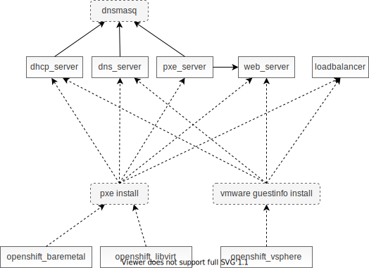

# OpenShift Automated User-Provided Infrastructure

Preparing infrastructure for OpenShift installation by hand is a rather tedious job. In order to save the effort, *openshift-auto-upi* provides a set of Ansible scripts that automate the infrastructure creation.

*openshift-auto-upi* comes with Ansible roles to provision OpenShift cluster hosts on the following target platforms:

* [Bare Metal](roles/openshift_baremetal)
* [Libvirt](roles/openshift_libvirt)
* [vSphere](roles/openshift_vsphere)

*openshift-auto-upi* comes with Ansible roles to provision and configure:

* [DHCP Server](roles/dhcp_server)
* [DNS Server](roles/dns_server)
* [PXE Server](roles/pxe_server)
* [Web Server](roles/web_server)
* [Load Balancer](roles/loadbalancer)

Note that the infrastructure from the above list provisioned using *openshift-auto-upi* is NOT meant for production use. It is meant to be a temporary fill in for your missing production-grade infrastructure. Using *openshift-auto-upi* to provision any of the infrastructure from the above list is optional.

# Deployment Overview


* **Helper Host** is a (virtual) machine that you must provide. It is a helper machine from which you will run *openshift-auto-upi* Ansible scripts. Any provisioned infrastructure (DHCP, DNS server, ...) will also be installed on the Helper host by default.
  * Helper host requires access to the Internet.
  * It is stronly discouraged to use *openshift-auto-upi* to provision infrastructure components on a bastion host. Services provisioned by *openshift-auto-upi* are not meant to be exposed to the public Internet.
  * If your goal is to deploy OpenShift on your laptop, you can run the *openshift-auto-upi* directly on your laptop and use Libvirt as your target platform.
* **OpenShift Hosts** will be provisioned for you by *openshift-auto-upi* unless your target platform is bare metal.

## Networking

*openshift-auto-upi* assumes that OpenShift hosts are assigned fixed IP addresses. This is accomplished by pairing the hosts MAC addresses with IP addresses in the DHCP server configuration. DHCP server then always assigns the same IP address to a specific host.

If the DNS server is managed by *openshift-auto-upi*, a DNS name will be created for each OpenShift host. These DNS names follow the scheme:
```
<hostname>.<cluster_name>.<base_domain>
```
Note that these names are created only for your convenience. *openshift-auto-upi* doesn't rely on their existence as they are not a requirement for installing OpenShift.

Note that in order to use DHCP and/or PXE server installed on the Helper host, the Helper host and all of the OpenShift hosts have to be provisioned on the same layer 2 network. In the opposite case, it is sufficient to have a working IP route between the Helper host and the OpenShift hosts.

Here is a sample libvirt network configuration. It instructs libvirt to not provide DNS and DHCP servers for this network. Instead, DNS and DHCP servers for this network will be provided by *openshift-auto-upi*.

```xml
<network>
  <name>default</name>
  <forward mode='nat'>
    <nat>
      <port start='1024' end='65535'/>
    </nat>
  </forward>
  <bridge name='default' stp='on' delay='0'/>
  <dns enable='no'/>
  <ip address='192.168.150.1' netmask='255.255.255.0'>
  </ip>
</network>
```

# Dependency Diagram

The dependency diagram below depicts the dependencies between *openshift-auto-upi* Ansible playbooks. You want to execute Ansible playbooks in the dependency order. First, run the *helper* playbook at the top and then continue from top to bottom with the remaining playbooks. Following sections describe the installation process in more detail.



# Setting Up Helper Host

There are two options to create a Helper Host:

* Create a Helper Host virtual machine. Recommended Helper Host machine size is 1 vCPU, 4 GB RAM, and 10 GB disk space. You have to install one of the supported operating systems on this machine.
* If you run one of the supported operating system on an existing machine, you can use that machine as your Helper Host.

Supported operating systems for the Helper Host are:

* Red Hat Enterprise Linux 7
* Red Hat Enterprise Linux 8
* Fedora release >= 31

Before continuing to the next section, follow the basic configuration steps described [here](docs/os_specific_config.md).

## Configuring Helper Host

```
$ yum install git
$ yum install ansible
```

```
$ git clone https://github.com/noseka1/openshift-auto-upi.git
$ cd openshift-auto-upi
```

Create custom *openshift_install_config.yml* configuration:

```
$ cp inventory/group_vars/all/openshift_install_config.yml.sample inventory/group_vars/all/openshift_install_config.yml
$ vi inventory/group_vars/all/openshift_install_config.yml
```

Create custom *openshift_cluster_hosts.yml* configuration:

```
$ cp inventory/group_vars/all/openshift_cluster_hosts.yml.sample inventory/group_vars/all/openshift_cluster_hosts.yml
$ vi inventory/group_vars/all/openshift_cluster_hosts.yml
```

Configure Helper host using Ansible:

```
$ ansible-playbook helper.yml
```

## Installing DHCP Server

Note that *dnsmasq.yml* configuration file is shared between the DHCP, DNS, and PXE servers.

```
$ cp inventory/group_vars/all/infra/dnsmasq.yml.sample inventory/group_vars/all/infra/dnsmasq.yml
$ vi inventory/group_vars/all/infra/dnsmasq.yml
```

```
$ cp inventory/group_vars/all/infra/dhcp_server.yml.sample inventory/group_vars/all/infra/dhcp_server.yml
$ vi inventory/group_vars/all/infra/dhcp_server.yml
```

Provision DHCP server on the Helper host using Ansible:

```
$ ansible-playbook dhcp_server.yml
```

## Installing DNS Server

Note that *dnsmasq.yml* configuration file is shared between the DHCP, DNS, and PXE servers.

```
$ cp inventory/group_vars/all/infra/dnsmasq.yml.sample inventory/group_vars/all/infra/dnsmasq.yml
$ vi inventory/group_vars/all/infra/dnsmasq.yml
```

```
$ cp inventory/group_vars/all/infra/dns_server.yml.sample inventory/group_vars/all/infra/dns_server.yml
$ vi inventory/group_vars/all/infra/dns_server.yml
```

Provision DNS server on the Helper host using Ansible:

```
$ ansible-playbook dns_server.yml
```

## Installing PXE Server

PXE server can be used for booting OpenShift hosts when installing on bare metal or libvirt target platform. Installation on vSphere doesn't use PXE boot at all.

Note that *dnsmasq.yml* configuration file is shared between the DHCP, DNS, and PXE servers.

```
$ cp inventory/group_vars/all/infra/dnsmasq.yml.sample inventory/group_vars/all/infra/dnsmasq.yml
$ vi inventory/group_vars/all/infra/dnsmasq.yml
```

Provision PXE server on the Helper host using Ansible:

```
$ ansible-playbook pxe_server.yml
```

## Installing Web Server

Web server is used to host installation artifacts such as ignition files and machine images. You can provision a Web server on the Helper host using Ansible:

```
$ ansible-playbook web_server.yml
```

## Installing Load Balancer

Provision load balancer on the Helper host using Ansible:

```
$ ansible-playbook loadbalancer.yml
```

## Configuring DNS Client

If you installed a DNS server on the Helper host, you may want to configure the Helper host to resolve OpenShift host names using this DNS server:

```
$ cp inventory/group_vars/all/infra/dns_client.yml.sample inventory/group_vars/all/infra/dns_client.yml
$ vi inventory/group_vars/all/infra/dns_client.yml
```

Configure the NetworkManager on the Helper host to forward OpenShift DNS queries to the local DNS server. Note that this playbook will issue `systemctl NetworkManager restart` to apply the configuration changes.

```
$ ansible-playbook dns_client.yml
```

# Installing OpenShift

## Installing OpenShift on Bare Metal

Kick off the OpenShift installation by issuing the command:

```
$ ansible-playbook openshift_baremetal.yml
```

## Installing OpenShift on Libvirt

Create custom *libvirt.yml* configuration:

```
$ cp inventory/group_vars/all/infra/libvirt.yml.sample inventory/group_vars/all/infra/libvirt.yml
$ vi inventory/group_vars/all/infra/libvirt.yml
```

Kick off the OpenShift installation by issuing the command:

```
$ ansible-playbook openshift_libvirt.yml
```

## Installing OpenShift on vSphere

Create custom *vsphere.yml* configuration:

```
$ cp inventory/group_vars/all/infra/vsphere.yml.sample inventory/group_vars/all/infra/vsphere.yml
$ vi inventory/group_vars/all/infra/vsphere.yml
```

Kick off the OpenShift installation by issuing the command:

```
$ ansible-playbook openshift_vsphere.yml
```
# Adding Cluster Nodes

Add the new hosts to the list of cluster hosts. At the same time, remove (comment out) the bootstrap host from the list to prevent the Ansible scripts from powering the bootstrap node back on:

```
$ vi inventory/group_vars/all/openshift_cluster_hosts.yml
```

If you are adding infra hosts and you use the load balancer managed by openshift-auto-upi, refresh the load balancer configuration by re-running the Ansible playbook:

```
$ ansible-playbook loadbalancer.yml
```

Re-run the platform-specific playbook to install the new cluster hosts:

```
$ ansible-playbook openshift_<baremetal|libvirt|vsphere>.yml
```

To allow the new nodes to join the cluster, you may need to sign their CSRs:

```
$ oc get csr
$ oc adm certificate approve <name>
```

# openshift-auto-upi Development

## TODO List

* Implement Libvirt using [fw_cfg](https://github.com/coreos/coreos-assembler/blob/master/src/cmd-run)
* Support oVirt
* Add documentation on the vm boot order: disk and then network
* Container registry mirror, [disconnected install](https://docs.openshift.com/container-platform/4.3/installing/install_config/installing-restricted-networks-preparations.html) (?)
* Installing python dependencies on RHEL7 (e.g. python-pyvmomi) can be a challenge
* Check [firewall](https://docs.openshift.com/container-platform/4.3/installing/install_config/configuring-firewall.html)

## Development Notes

* IPMI can be tested on virtual machines using [VirtualBMC](https://github.com/openstack/virtualbmc)
* Check Ansible code using `ansible-lint *.yml`

# References

Projects similar to *openshift-auto-upi*:
* [ocp4-upi-helpernode](https://github.com/christianh814/ocp4-upi-helpernode)
* [ocp4-vsphere-upi-automation](https://github.com/vchintal/ocp4-vsphere-upi-automation)
* [openshift4-rhv-upi](https://github.com/sa-ne/openshift4-rhv-upi)
* [openshift4-vmware-upi](https://github.com/sa-ne/openshift4-vmware-upi)
