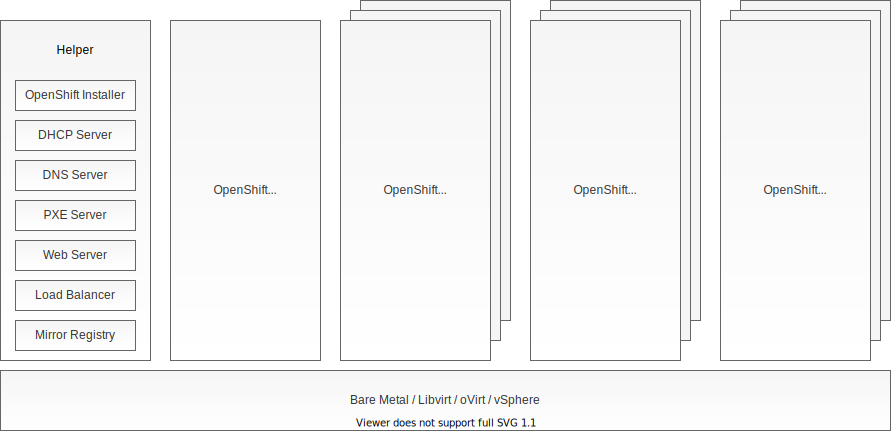

# OpenShift Automated User-Provided Infrastructure

> :exclamation: Red Hat support cannot assist with problems with this repo.

Installing OpenShift 4 on user-provided-infrastructure by hand is a rather tedious job. In order to save the effort, *openshift-auto-upi* provides a set of Ansible scripts that automate the OpenShift UPI deployment by implementing the deployment steps described in [Installing a cluster on any platform](https://docs.openshift.com/container-platform/4.7/installing/installing_platform_agnostic/installing-platform-agnostic.html).

> *openshift-auto-upi* is great for situations where the IPI installation method is not flexible enough and on the other hand the UPI installation is too tedious.

*openshift-auto-upi* is a separate tool, and is not in any way part of the OpenShift product. It enhances the *openshift-installer* by including automation for the following:

*openshift-auto-upi* comes with Ansible roles to deploy OpenShift cluster on the following target platforms:

* [Bare Metal](roles/openshift_baremetal)
* [Libvirt](roles/openshift_libvirt_fwcfg)
* [oVirt (RHV)](roles/openshift_ovirt)
* [vSphere](roles/openshift_vsphere)

*openshift-auto-upi* comes with Ansible roles to provision and configure:

* [DHCP Server](roles/dhcp_server)
* [DNS Server](roles/dns_server)
* [PXE Server](roles/pxe_server)
* [Web Server](roles/web_server)
* [Load Balancer](roles/loadbalancer)
* [Mirror Registry](roles/mirror_registry)

Note that the infrastructure from the above list provisioned using *openshift-auto-upi* is NOT meant for production use. It is meant to be a temporary fill in for your missing production-grade infrastructure. Using *openshift-auto-upi* to provision any of the infrastructure from the above list is optional.

Some of the features offered by *openshift-auto-upi*:

* Node network configuration via DHCP (using fixed IPs) or static network configuration
* User has full control over the `install-config.yaml` file and can customize it according to her/his needs.
* User can customize ignition config files using filetranspiler and jsonpatch, see also [Customizing Ignition Configs](docs/customizing_ignition_configs.md)
* Ignition config files are protected from being overwritten, see also [Ignition Config Protection](docs/ignition_config_protection.md)
* Automated download of CoreOS images from Red Hat sites and upload onto the target platform
* Automated bare metal installation, control of remote machines using BMC
* Adding nodes to the existing cluster is supported and documented
* `openshift-auto-upi` won't touch the existing cluster nodes. It doesn't even trust the Ansible modules to not modify the existing nodes. Instead, it skips existing nodes altogether for maximum safety.

# Deployment Overview



* **Helper host** is a (virtual) machine that you must provide. It is a helper machine from which you will run *openshift-auto-upi* Ansible scripts. Any provisioned infrastructure (DHCP, DNS server, ...) will also be installed on the Helper host by default.
  * Helper host requires access to the Internet.
  * It is stronly discouraged to use *openshift-auto-upi* to provision infrastructure components on a bastion host. Services provisioned by *openshift-auto-upi* are not meant to be exposed to the public Internet.
  * If your goal is to deploy OpenShift on your laptop, you can run the *openshift-auto-upi* directly on your laptop and use the local Libvirt as your target platform.
* **OpenShift hosts** will be provisioned for you by *openshift-auto-upi* unless your target platform is bare metal.

## Networking

*openshift-auto-upi* assumes that OpenShift hosts are assigned fixed IP addresses. If DHCP is used for network configuration, this is accomplished by pairing the hosts MAC addresses with IP addresses in the DHCP server configuration. DHCP server then always assigns the same IP address to a specific host.

Note that in order to use DHCP and/or PXE server installed on the Helper host, the Helper host and all of the OpenShift hosts have to be provisioned on the same *layer 2 network*. In the opposite case, it is sufficient to have a working IP route between the Helper host and the OpenShift hosts.

If the DNS server is managed by *openshift-auto-upi*, a DNS name will be created for each OpenShift host. These DNS names follow the scheme:
```
<hostname>.<cluster_name>.<base_domain>
```
Note that these names are created only for your convenience. *openshift-auto-upi* doesn't rely on their existence as they are not required for installing OpenShift.

### Using Static IPs

If you prefer configuring your OpenShift hosts using static network configuration (Static IPs) as opposed to leveraging the default network configuration via DHCP, *openshift-auto-upi* allows you to do that. Note that Static IPs feature is currently implemented for bare metal, Libvirt PXE, oVirt, and vSphere target platforms. Static IPs for Libvirt FwCfg is not implemented at this time.

While you are configuring *openshift-auto-upi* (detailed information in the following sections), add your network configuration (gateway, netmask, name servers) to the *static_ips* section of the *openshift_install_config.yml* file:

```
$ cp inventory/group_vars/all/openshift_install_config.yml.sample \
    inventory/group_vars/all/openshift_install_config.yml
$ vi inventory/group_vars/all/openshift_install_config.yml
```
Remember to set the variable static_ips.enabled=True in the same file. You are all set! *openshift-auto-upi* will configure your OpenShift nodes using static IPs.

Current state of static IP support in `openshift-auto-upi`:
| Bare metal | Libvirt FwCfg | Libvirt PXE | oVirt | vSphere |
|:-:|:-:|:-:|:-:|:-:|
| PXE boot menu (requires DHCP for initial node provisioning) | Not supported | PXE boot menu (requires DHCP for initial node provisioning) | [Custom design](https://www.openshift.com/blog/openshift-upi-using-static-ips) | Guestinfo variables (requires OCP >= 4.6) |

## Platform-specific Documentation

[Installing OpenShift on Libvirt](docs/openshift_libvirt.md)

## Deployment Playbooks

The table below depicts the *openshift-auto-upi* Ansible playbooks that you need to execute in order to deploy OpenShift on select target platform. Execute the Ansible playbooks in the order from top to bottom.

| | Bare metal | Libvirt FwCfg | Libvirt PXE | oVirt | vSphere |
|-|:-:|:-:|:-:|:-:|:-:|
| **mirror_registry** | optional | optional | optional | optional | optional |
| **clients** | required | required | required | required | required |
| **dhcp_server** | optional | optional | optional | optional | optional | optional |
| **dns_server** | optional | optional | optional | optional | optional | optional |
| **pxe_server** | required | - | required | - | - | - |
| **web_server** | required | - | required | - | - | - |
| **loadbalancer** | optional | optional | optional | optional | optional |
| **dns_client** | optional | optional | optional | optional | optional |

Following sections describe the installation process in more detail.
 
# Setting up Helper Host

There are two options to create a Helper host:

* Create a Helper host virtual machine. Minimum recommended Helper host machine size is 1 vCPU, 4 GB RAM, and 10 GB disk space. You have to install one of the supported operating systems on this machine.
* If you run one of the supported operating system on an existing machine, you can use that machine as your Helper host.

Supported operating systems for the Helper host are:

* Red Hat Enterprise Linux 7
* Red Hat Enterprise Linux 8
* Fedora release >= 31

Before continuing with the next steps, make sure that you applied the [OS-specific configuration instructions](docs/os_specific_config.md).

```
$ yum install git
$ yum install ansible
```
Clone the *openshift-auto-upi* repo to your Helper host and check out a tagged release. I recommend that you use a tagged release which receives more testing than master:

```
$ git clone https://github.com/noseka1/openshift-auto-upi.git
$ git checkout <release_tag>
$ cd openshift-auto-upi
```
## Preparing for OpenShift Installation

Create custom *openshift_install_config.yml* configuration:

```
$ cp inventory/group_vars/all/openshift_install_config.yml.sample \
    inventory/group_vars/all/openshift_install_config.yml
$ vi inventory/group_vars/all/openshift_install_config.yml
```

Download OpenShift clients using Ansible:

```
$ ansible-playbook clients.yml
```

## Installing in air-gapped (disconnected) environments

If you are installing OpenShift in a an environment that is not connected to the Internet, you will need to create a local mirror registry. This registry will contain all OpenShift container images required for the installation. *openshift-auto-upi* automates the creation of the mirror registry by implementing the steps described in the [Creating a mirror registry](https://docs.openshift.com/container-platform/latest/installing/install_config/installing-restricted-networks-preparations.html). To set up a mirror registry:

```
$ cp inventory/group_vars/all/infra/mirror_registry.yml.sample \
    inventory/group_vars/all/infra/mirror_registry.yml
$ vi inventory/group_vars/all/infra/mirror_registry.yml
```

```
$ ansible-playbook mirror_registry.yml
```

For mirroring operator images and creating custom operator catalog based on the desired operators refer to the [ocp4-offline-operator-mirror](https://github.com/openshift-telco/ocp4-offline-operator-mirror) repository.


## Defining OpenShift cluster hosts

Create custom *openshift_cluster_hosts.yml* configuration:

```
$ cp inventory/group_vars/all/openshift_cluster_hosts.yml.sample \
    inventory/group_vars/all/openshift_cluster_hosts.yml
$ vi inventory/group_vars/all/openshift_cluster_hosts.yml
```

## Installing DHCP Server

Note that *dnsmasq.yml* configuration file is shared between the DHCP, DNS, and PXE servers.

```
$ cp inventory/group_vars/all/infra/dnsmasq.yml.sample inventory/group_vars/all/infra/dnsmasq.yml
$ vi inventory/group_vars/all/infra/dnsmasq.yml
```

```
$ cp inventory/group_vars/all/infra/dhcp_server.yml.sample inventory/group_vars/all/infra/dhcp_server.yml
$ vi inventory/group_vars/all/infra/dhcp_server.yml
```

Provision DHCP server on the Helper host using Ansible:

```
$ ansible-playbook dhcp_server.yml
```

## Installing DNS Server

Note that *dnsmasq.yml* configuration file is shared between the DHCP, DNS, and PXE servers.

```
$ cp inventory/group_vars/all/infra/dnsmasq.yml.sample inventory/group_vars/all/infra/dnsmasq.yml
$ vi inventory/group_vars/all/infra/dnsmasq.yml
```

```
$ cp inventory/group_vars/all/infra/dns_server.yml.sample inventory/group_vars/all/infra/dns_server.yml
$ vi inventory/group_vars/all/infra/dns_server.yml
```

Provision DNS server on the Helper host using Ansible:

```
$ ansible-playbook dns_server.yml
```

## Installing PXE Server

PXE server is used for booting OpenShift hosts when installing on bare metal. It can also be used for bare metal-like OpenShift installation on other target platforms like Libvirt, oVirt, and vSphere.

Note that *dnsmasq.yml* configuration file is shared between the DHCP, DNS, and PXE servers.

```
$ cp inventory/group_vars/all/infra/dnsmasq.yml.sample inventory/group_vars/all/infra/dnsmasq.yml
$ vi inventory/group_vars/all/infra/dnsmasq.yml
```

Provision PXE server on the Helper host using Ansible:

```
$ ansible-playbook pxe_server.yml
```

## Installing Web Server

Web server is used to host installation artifacts such as ignition files and machine images. You can provision a Web server on the Helper host using Ansible:

```
$ ansible-playbook web_server.yml
```

## Installing Load Balancer

Provision load balancer on the Helper host using Ansible:

```
$ ansible-playbook loadbalancer.yml
```

## Configuring DNS Client

If you used *openshift-auto-upi* to deploy a DNS server, you may want to configure the Helper host to resolve OpenShift host names using this DNS server:

```
$ cp inventory/group_vars/all/infra/dns_client.yml.sample inventory/group_vars/all/infra/dns_client.yml
$ vi inventory/group_vars/all/infra/dns_client.yml
```

Configure the NetworkManager on the Helper host to forward OpenShift DNS queries to the local DNS server. Note that this playbook will issue `systemctl NetworkManager restart` to apply the configuration changes.

```
$ ansible-playbook dns_client.yml
```

# Installing OpenShift

To make the control plane machines unschedulable, see [Making control-plane unschedulable](docs/control_plane_scheduling.md).

## Installing OpenShift on Bare Metal

Create your `install-config.yaml` file:

```
$ cp files/common/install-config.yaml.sample files/common/install-config.yaml
$ vi files/common/install-config.yaml
```

Kick off the OpenShift installation by issuing the command:

```
$ ansible-playbook openshift_baremetal.yml
```

## Installing OpenShift on Libvirt

Create custom *libvirt.yml* configuration:

```
$ cp inventory/group_vars/all/infra/libvirt.yml.sample inventory/group_vars/all/infra/libvirt.yml
$ vi inventory/group_vars/all/infra/libvirt.yml
```

Create your `install-config.yaml` file:

```
$ cp files/common/install-config.yaml.sample files/common/install-config.yaml
$ vi files/common/install-config.yaml
```

In order to install OpenShift using the Libvirt FwCfg method, kick off the installation by issuing the command:

```
$ ansible-playbook openshift_libvirt_fwcfg.yml
```

Alternatively, in order to install OpenShift using the Libvirt PXE method, kick off the installation by issuing the command:

```
$ ansible-playbook openshift_libvirt_pxe.yml
```


## Installing OpenShift on oVirt

Create custom *ovirt.yml* configuration:

```
$ cp inventory/group_vars/all/infra/ovirt.yml.sample inventory/group_vars/all/infra/ovirt.yml
$ vi inventory/group_vars/all/infra/ovirt.yml
```

Create your `install-config.yaml` file:

```
$ cp files/common/install-config.yaml.sample files/common/install-config.yaml
$ vi files/common/install-config.yaml
```

Kick off the OpenShift installation by issuing the command:

```
$ ansible-playbook openshift_ovirt.yml
```

## Installing OpenShift on vSphere

Create custom *vsphere.yml* configuration:

```
$ cp inventory/group_vars/all/infra/vsphere.yml.sample inventory/group_vars/all/infra/vsphere.yml
$ vi inventory/group_vars/all/infra/vsphere.yml
```

Create your `install-config.yaml` file:

```
$ cp files/common/install-config.yaml.sample files/common/install-config.yaml
$ vi files/common/install-config.yaml
```

Kick off the OpenShift installation by issuing the command:

```
$ ansible-playbook openshift_vsphere.yml
```
# Adding Cluster Nodes

Add the new hosts to the list of cluster hosts:

```
$ vi inventory/group_vars/all/openshift_cluster_hosts.yml
```

If you are adding infra hosts and you use the load balancer managed by openshift-auto-upi, refresh the load balancer configuration by re-running the Ansible playbook:

```
$ ansible-playbook loadbalancer.yml
```

Re-run the platform-specific playbook to install the new cluster hosts:

```
$ ansible-playbook openshift_<baremetal|libvirt_fwcfg|libvirt_pxe|ovirt|vsphere>.yml
```

To allow the new nodes to join the cluster, you may need to sign their CSRs:

```
$ oc get csr
$ oc adm certificate approve <name>
```

# Reinstalling OpenShift

## Deleting Old OpenShift Installer Configuration

Delete the old OpenShift installer configuration unless you want to reuse the same ignition configs for the next OpenShift installation. Note that some of the TLS certificates included in the *bootstrap.ign* file expire in 24 hours. After those certificates expire, they can't no longer be used for cluster installation.

```
$ ansible-playbook delete_install_config.yml
```

Delete virtual machines before restarting the installation of the OpenShift cluster:

## Deleting VMs on vSphere

```
$ ansible-playbook delete_vsphere.yml
```

## Deleting VMs on oVirt

```
$ ansible-playbook openshift_ovirt.yml
```

## Deleting VMs on Libvirt

If you want to directly run the playbook on the KVM host but not the helper host, use the -e flag and set the hostname or IP address. 
You can also add the KVM hostname or IP address `inventory/helper.ini` instead of specifying extra vars with -e flag.

```
$ ansible-playbook delete_libvirt.yml -e 'ansible_host=<kvm hostname or ip address> ansible_connection=ssh'
```

# Contributing

To contribue please fork this repository, make your changes on the `master` branch and file a pull request.

## TODO List

Refer to the [openshift-auto-upi project board](https://github.com/noseka1/openshift-auto-upi/projects/3)

## Development Notes

* IPMI can be tested on virtual machines using [VirtualBMC](https://github.com/openstack/virtualbmc)
* Check Ansible code using `ansible-lint *.yml`

# References

Projects similar to *openshift-auto-upi*:
* [ocp4-helpernode](https://github.com/RedHatOfficial/ocp4-helpernode)
* [ocp4-vsphere-upi-automation](https://github.com/RedHatOfficial/ocp4-vsphere-upi-automation)
* [openshift4-rhv-upi](https://github.com/sa-ne/openshift4-rhv-upi)
* [openshift4-vmware-upi](https://github.com/sa-ne/openshift4-vmware-upi)
